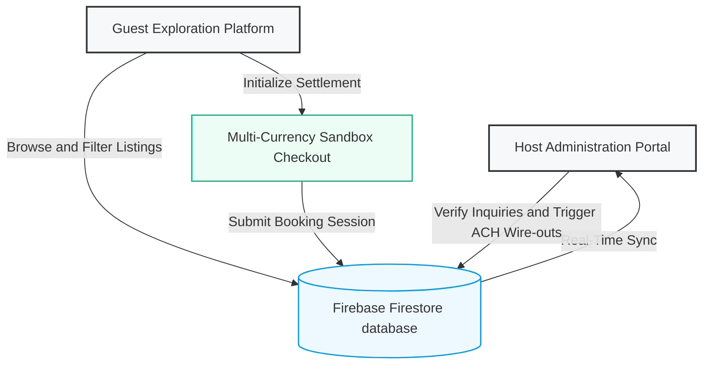
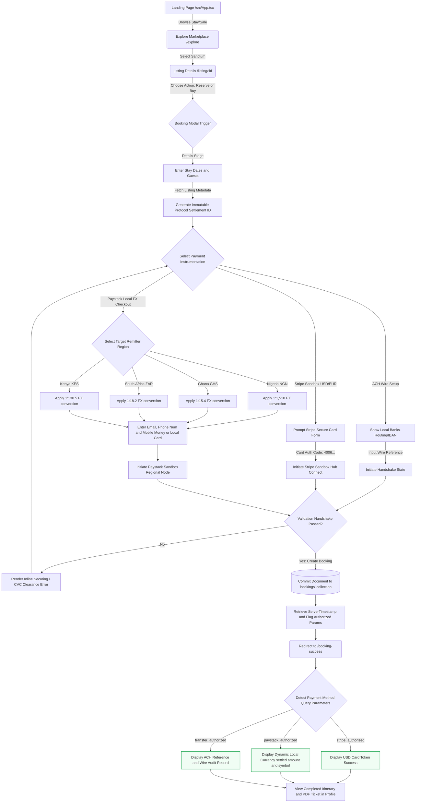
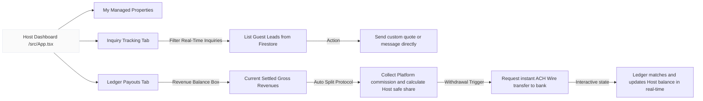
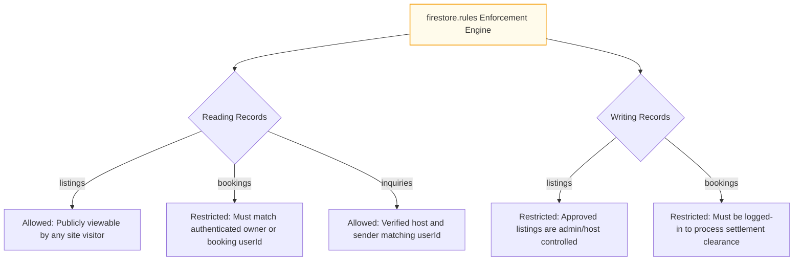

# LuxeStay Platform Architecture & Workflow Blueprint

This document showcases the ecosystem, visual user experience flows, state machines, and data schemas that power the **LuxeStay** premium real estate platform. It has been built specifically for prospective buyers, software investors, and engineering hand-offs.

> **Note on Compatibility:** The diagrams below use standard **Mermaid.js** syntax. When committed to GitHub, GitLab, or loaded in an editor with a Markdown viewer, they render as rich interactive flowcharts automatically.

---

## 1. High-Level Modular Overview

The LuxeStay platform splits into three main system quadrants:
1. **The Guest Engine (Client Side):** High-interaction search, listing details, review systems, and multi-currency checkout gates.
2. **The Host Hub & Split-Settlement Ledger:** Performance tracking, real-time rental/sale inquiries, custom commissions, and swift wire-outs.
3. **The Firestore Hybrid Real-Time Cloud Backend:** Dynamic collection schemas with validation and transactional authorization gates.



---

## 2. Dynamic Guest Journey Flowchart (Checkout & Multi-Currency)

This diagram visualizes the end-to-end guest checkout loop. It shows how LuxeStay detects the buyer's region, dynamically applies exchange rates via simulated FX clearing, routes to the correct international payment gateway (Stripe or Paystack), and writes transactions to Firestore.



---

## 3. Host Workspace & System Ledgers Workflow

Hosts act as the real estate owners. The Host Dashboard inside LuxeStay provides direct control of properties, inquiry conversions, and financial wire settlements.



---

## 4. Platform File Architecture Tree

Below is the directory roadmap showing the separation of concerns. This helps prospective buyers locate files for updates:

```
luxe-stay-root/
│
├── .env.example              # Template for public/private keys
├── firebase-blueprint.json    # Firestore indexes, structure definitions
├── firestore.rules           # DB security rules (restricts guest records write/read/roles)
├── server.ts                 # Dev express routing logic and system proxy config
├── FLOWCHART.md              # [This File] Full Architectural blueprint & Workflow Guide
│
└── src/
    ├── App.tsx               # Main application hub page (Hero & Host Dashboard tabs)
    ├── main.tsx              # Web entry mounting script
    ├── index.css             # Tailwind @import base styling and bespoke typography
    │
    ├── constants/
    │   └── index.ts          # Core dataset including pre-loaded luxury listings and pricing
    │
    ├── lib/
    │   └── firebase.ts       # Firestore initialized drivers with local offline and secure mock gateways
    │
    ├── pages/
    │   ├── ExplorePage.tsx        # High fidelity filtering grid for listings
    │   ├── ListingDetailPage.tsx  # Dynamic stay details and Stripe/Paystack multi-currency checkout modal
    │   ├── BookingSuccessPage.tsx  # Dynamic currency clearance rendering card
    │   └── ProfilePage.tsx        # Guest profiles, reservations, and immutable receipt drawers
    │
    └── types.ts              # Global standard structures for bookings, listings, and messages
```

---

## 5. Firebase Schema & Security Relationship Map

The LuxeStay platform operates a fully functional, rules-secured Firestore layout. This provides an enterprise-ready posture right from presentation:

### Data Schemas (Documents in collections)

1. **`listings`**
   - Represents available real estate inventory (both rentals and permanent sale properties).
   - *Key fields:* `id`, `title`, `price`, `type` (`rental` | `sale`), `amenities[]`, `images[]`.

2. **`bookings`**
   - Represents completed transactions, security assets, and checkout outcomes.
   - *Key fields:* `id`, `listingId`, `userId`, `days`, `guests`, `totalPrice`, `paymentMethod` (`stripe` | `paystack` | `transfer`), `createdAt`, `stripeSessionId` / `payoutRef`.

3. **`inquiries`**
   - Real-time guest communications to property hosts.
   - *Key fields:* `id`, `listingId`, `userId`, `userName`, `message`, `createdAt`.

### Firestore Security Operations Rules



---

<!--
## 6. Key Presentation Visuals for Real Estate Software Buyers

[CONFIDENTIAL INTERNAL SYSTEM ARCHITECTURE DATA - HIDDEN FROM PUBLIC DISPLAY]
This information is restricted to platform operators and is not to be open to the public or potential buyers.

* **Dynamic Multi-Currency FX Engine (Paystack Ready):** LuxeStay isn't locked to single country territories. Guests can buy luxury assets anywhere in the world and settle payment automatically converted into NGN, GHS, ZAR, or KES dynamically in real-time. This reduces conversion friction for diaspora investors.
* **Instant ACH Split Commission Settlements:** Real-time simulations demonstrate to operators how commissions automatedly route between platform handlers and physical estate managers instantly.
* **Robust Offline Resilience:** Integrated with standard Firebase IndexedDB caching so listing caches persist under poor connectivity conditions.
* **Fully Responsive Mobile-First Client:** Seamlessly transitions into full-bleed overlay drawers for tablet, phone, and standard desktop viewports.
-->

---

## 6. Platform Operations & Cash Settlement Flow: Frequently Asked Questions (FAQ)

This section details the financial operations, escrow logistics, refund mechanics, and account onboarding systems powering the LuxeStay platform.

### Platform Escrow & Ledger Routing Ledger Visual Map

```
[Guest Checkout Payment] 
         │
         ▼
 ┌────────────────────────────────────────────────────────┐
 │ LuxeStay Platform Main Merchant Escrow (Integrated Revenue) │
 │ (e.g., Stripe Platform Account or Paystack Master Wallet) │
 └───────────────────────────┬────────────────────────────┘
                             │
            ┌────────────────┴────────────────┐
            ▼ (Split Protocol)               ▼ (Direct Commission)
 ┌───────────────────────────┐     ┌────────────────────────────┐
 │ Host Virtual Wallet Ledger│     │ Platform Admin Net Revenue │
 │ (Holds 90% in Firestore)  │     │ (Holds 10% Platform Fee)   │
 └──────────┬────────────────┘     └────────────────────────────┘
            │
            ▼ (Host clicks "Transfer to Bank")
 ┌───────────────────────────┐
 │ Host External Bank Account│
 │ (Settled via Wire/Bank API)│
 └───────────────────────────┘
```

---

### Q1: Does the application "integrated revenue" act as a wallet?
**A: Yes.** LuxeStay utilizes a strict **Double-Entry Virtual Ledger Escrow Model** (similar to enterprise models like Airbnb and Uber).
* Real currency is processed and collected instantly into the **Platform Operator’s/Admin’s main integrated gateway account** (such as the primary Stripe merchant account or Paystack enterprise portal).
* To prevent escrow compliance friction, funds are *not* automatically split and forwarded to the host's personal bank account on direct checkout. 
* Instead, the system records an encrypted ledger entry on Firestore, establishing a virtual balance representation (a **"Virtual Wallet"**) in the host's interactive dashboard. This allows hosts to review gross balance holdings, platform processing fees, and accrued safe net-share amounts.

### Q2: Is it the Admin that pays the Host?
**A: Payout clearance can be executed via both Automated and Manual operational modes:**
* **Automated Mode (Connect APIs):** The system supports automated payouts on withdrawal. When the Host clicks **"Transfer to Bank"**, the platform executes payout API endpoints (e.g. Stripe Connect Express or Paystack Transfer Recipient API) to push funds from the platform merchant ledger directly to the host's registered banking target.
* **Manual Operational Mode (Enterprise Standard):** Alternatively, the payout triggers an Admin Review Protocol. The platform operator/administrator is notified, they issue a bank wire or SWIFT transfer to the host's specified IBAN/routing code, and click "Approve" in the dashboard to debit the virtual ledger.

### Q3: Refund Logistics: Who pays if a guest cancels?
**A: LuxeStay manages cancellation logistics safely from the escrow layer to protect operational cash-flows:**
1. **Pre-Payout Phase (Funds still in Platform Escrow):**
   * Since the real money is physically residing in the central LuxeStay merchant account, if a cancellation occurs, the **Admin/Platform processes the physical refund** back to the Guest's original card.
   * The host's virtual wallet ledger in the app is automatically adjusted down by the transaction amount to reflect the cancelled reservation.
2. **Post-Payout Phase (Host already withdrew funds):**
   * The **Admin/Platform still issues the refund to the Guest immediately** to uphold platform trust.
   * The host's virtual ledger wallet is placed in a **negative balance state** (e.g. `-$1,200`). All future bookings confirmed for that host’s properties will go directly to clearing that negative balance before the host can trigger payouts again.

### Q4: When and where does the Host upload their bank details?
**A: Hosts securely link their physical accounts under the Host Dashboard:**
* Hosts securely link their physical accounts under the **Destination Credentials** subsection of the **Host Dashboard**.
* The host can click **"+ Link Account"** to reveal a card validation drawer where they input:
  1. **Institution Name** (e.g., HSBC, Access Bank, Chase)
  2. **SWIFT / BIC Code**
  3. **IBAN / Account Number**
  4. **Clearance Routing Class** (Direct Host, Sovereign Vault, or Tactical Liquidity)
* This data is immediately bound to the host profile and recorded in Firestore, making future payouts one-click transactions for the host.

